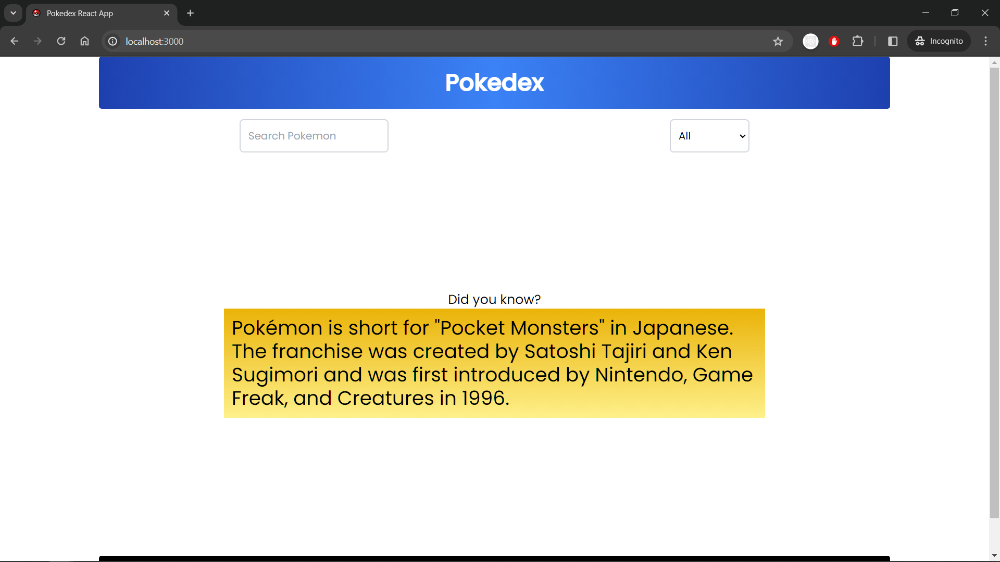
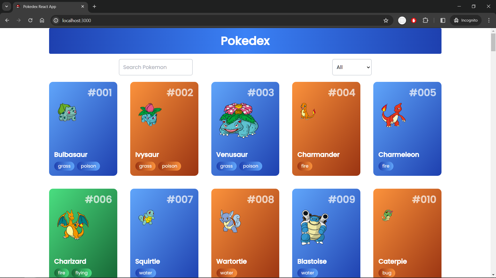
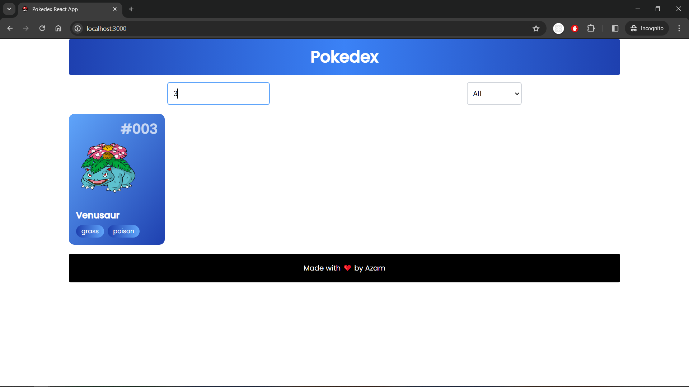
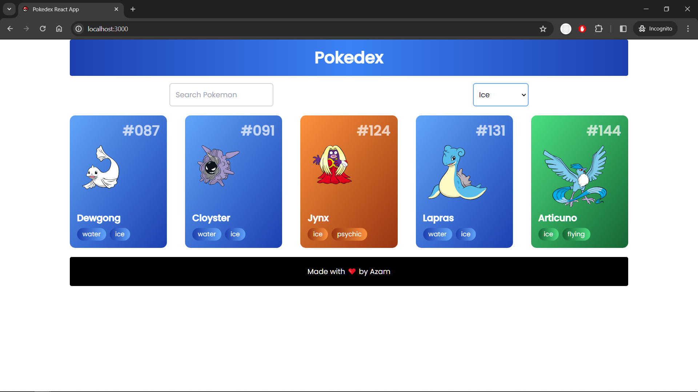
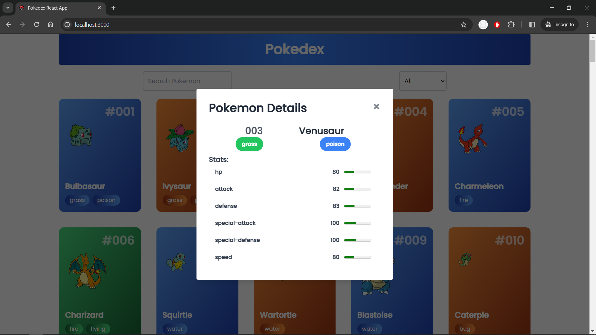

# Pokedex React App

This is a simple Pokedex app built with React and the [PokeAPI](https://pokeapi.co/).

# Table of Contents

- [Technologies Used](#technologies-used)
- [Screenshots](#screenshots)
- [Installation](#installation)
- [Usage](#usage)
- [Author](#author)

## Technologies Used

- [React](https://reactjs.org/) - JavaScript library for building user interfaces
- [PokeAPI](https://pokeapi.co/) - The RESTful Pokémon API
- [Axios](https://axios-http.com/) - Promise based HTTP client for the browser and node.js
- [Tailwind CSS](https://tailwindcss.com/) - A utility-first CSS framework for rapidly building custom designs

## Screenshots

Loading Screen


Infinite Scroll


Search Functionality


Types Filter Functionality


Modal View Functionality


## Installation

1. Clone the repo

```sh
git clone https://github.com/mazam5/Pokedex-React.js
```

2. Install NPM packages

```sh
npm install
```

or

```sh
yarn install
```

## Usage

- Navigate to the root directory and run the following commands:

1. Run the app

```sh
npm start
```

or

```sh
yarn start
```

2. Open [http://localhost:3000](http://localhost:3000) to view it in the browser.

If the above commands don't work, try the following:

- Install [Node.js](https://nodejs.org/en/download/)
- Install [Yarn](https://classic.yarnpkg.com/en/docs/install/#windows-stable)
- Install [Git](https://git-scm.com/downloads)

## Author

- [Mohammed Azam](https://www.linkedin.com/in/azam5)
